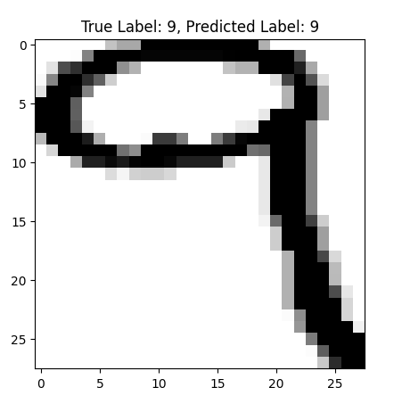

# Persian MNIST Digit Recognizer

, [Sample Image2](accuracy_image.png)

## Overview
This project is a digit recognizer for Persian handwritten digits using Convolutional Neural Networks (CNN). It is implemented in Python using the TensorFlow and Keras libraries.

## Project Structure
- https://www.kaggle.com/code/metasina/persian-mnist-digit-recognizer/notebook : Jupyter Notebook containing the main code for the digit recognizer.
- https://www.kaggle.com/datasets/metasina/persian-mnist : The Persian MNIST dataset.
- `model/`: Folder containing saved models.

## Usage
1. Clone the repository:
   ```bash
   git clone https://github.com/meta-syfu/persian-mnist-digit-recognizer.git
   cd persian-mnist-digit-recognizer
